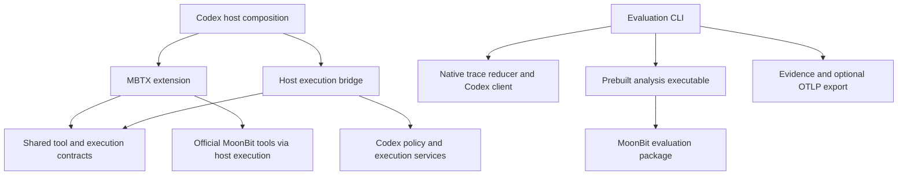
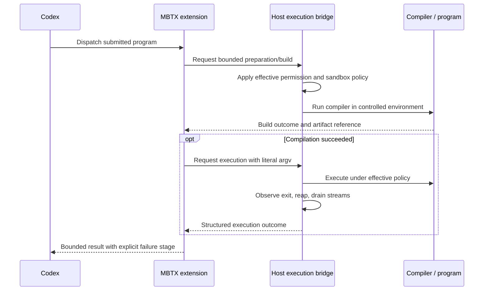

# Programmable MBTX Architecture

**Status:** Accepted architectural direction; implementation has not started.
**Baseline inspected:** `31ffe2bc9adccfe5fd3d29208250f796a13aa7a0` on 2026-09-15.
**Scope:** The `ZSeanYves/codex-mbtx-runtime` fork of `openai/codex`.

This document defines the responsibilities, dependency boundaries, runtime
contracts, and evidence requirements for programmable MBTX research. It is the
authoritative architecture for this fork. It records source inspection, not a
successful build, a working MBTX integration, or experimental results.

The initial change creates only this document, its discovery links, and empty
`.gitkeep` files. Reserved directories are not active Cargo or MoonBit packages.
No new manifests, dependencies, configuration keys, commands, or workflows are
registered. API field names and commands described as proposed below become
supported only with their implementation and validation.

## Contents

- [Purpose and scope](#purpose-and-scope)
- [Verified upstream foundation](#verified-upstream-foundation)
- [Repository and package structure](#repository-and-package-structure)
- [Dependencies and ownership](#dependencies-and-ownership)
- [Program tool contract](#program-tool-contract)
- [Execution, permissions, and lifecycle](#execution-permissions-and-lifecycle)
- [Toolchain, target, and build reuse](#toolchain-target-and-build-reuse)
- [Step and request accounting](#step-and-request-accounting)
- [Evidence and recovery](#evidence-and-recovery)
- [Experimental design and request pacing](#experimental-design-and-request-pacing)
- [Observability and reports](#observability-and-reports)
- [Build, validation, and integration](#build-validation-and-integration)
- [Implementation stages and open decisions](#implementation-stages-and-open-decisions)

## Purpose and scope

The research question is:

> Under the same task goal, model, available capabilities, permissions, and
> correctness oracle, does a programmable MoonBit interface reduce the logical
> agent steps needed to complete work compared with a Shell execution tool?

The primary outcomes are task success and steps to success. Tool calls,
compilation errors, repair attempts, tokens, process operations, and timing
explain the outcome. Fewer steps alone do not establish lower latency, lower
cost, less model reasoning, or fewer machine instructions.

Use two experiment arm labels: `shell_tool` and `mbtx_program`. These describe
research conditions, not existing configuration keys. Shell remains the product
default. Programmable MBTX will require explicit enablement.

| Repository                                                            | Responsibility                                                                                                                  |
| --------------------------------------------------------------------- | ------------------------------------------------------------------------------------------------------------------------------- |
| [codex-mbtx-runtime](https://github.com/ZSeanYves/codex-mbtx-runtime) | Programmable tool implementation, step research, and its evidence contracts.                                                    |
| [Codex-MBTX](https://github.com/ZSeanYves/Codex-MBTX)                 | Existing transparent launcher, compatibility/performance measurements, OTel collection, process traces, and historical reports. |

This fork does not add a transparent-launcher cohort or reuse its measurements
as evidence of a programmable tool's benefit. It does not introduce a separate
agent loop, shell parser, general jobs protocol, or independent session manager.
Persistent language sessions, remote MBTX execution, delegation, and Code Mode
comparisons are outside the first implementation.

The fork must build and run without a checkout of the old repository. Reusable
code is copied selectively with source revision, license, and relevant tests
recorded. Historical reports and raw evidence retain their original conclusions
and hashes; they are not migrated into new experimental results.

## Verified upstream foundation

The following are observations about the inspected baseline. Recheck affected
interfaces after an upstream update.

| Existing area                                                                                                                                 | Observed responsibility                                                                          | Architectural use                                                                                          |
| --------------------------------------------------------------------------------------------------------------------------------------------- | ------------------------------------------------------------------------------------------------ | ---------------------------------------------------------------------------------------------------------- |
| [Rust workspace](../codex-rs/Cargo.toml)                                                                                                      | Explicit workspace members and shared dependencies.                                              | Add small crates within the existing workspace when implementation begins.                                 |
| [Tool contributors](../codex-rs/ext/extension-api/src/contributors.rs) and [tool calls](../codex-rs/tools/src/tool_call.rs)                   | Feature-owned tools, lifecycle callbacks, payloads, filesystem environments, and result context. | Register MBTX through the existing extension mechanism.                                                    |
| [Extension assembly](../codex-rs/app-server/src/extensions.rs)                                                                                | Host construction of the extension registry.                                                     | Install the feature at an appropriate host composition point.                                              |
| [unified_exec handler](../codex-rs/core/src/tools/handlers/unified_exec/exec_command.rs) and [exec-server](../codex-rs/exec-server/README.md) | Host execution orchestration and subprocess services.                                            | Reuse policy, sandbox, process, and output handling through a narrow bridge.                               |
| [Rollout trace](../codex-rs/rollout-trace/README.md)                                                                                          | Raw local bundles and an offline semantic reducer.                                               | Preserve native evidence and identity relationships.                                                       |
| [Inference tracing](../codex-rs/rollout-trace/src/inference.rs)                                                                               | Attempt IDs for concrete upstream requests, including retry/fallback paths.                      | Associate attempts with a separately established logical step.                                             |
| [Sampling loop](../codex-rs/core/src/session/turn.rs) and [step context](../codex-rs/core/src/session/step_context.rs)                        | Sampling control and request-scoped state.                                                       | Establish the logical-round boundary without guessing from log counts.                                     |
| [OTel](../codex-rs/otel/README.md)                                                                                                            | Log, trace, and metric export plus session telemetry.                                            | Extend existing instrumentation and export to a local collector.                                           |
| [Responses API proxy](../codex-rs/responses-api-proxy/README.md)                                                                              | A constrained OpenAI forwarding service.                                                         | Inspect reuse opportunities; arbitrary relay routing and account-wide pacing are not assumed capabilities. |

Two integration gaps are already visible. `ToolCall` does not directly expose a
complete policy-aware process capability, cancellation token, or reap service.
An extension cannot preserve execution semantics merely by spawning its own
process. Also, an `inference_call_id` identifies a request attempt, not a logical
agent round. Neither gap is solved by directory scaffolding.

## Repository and package structure

Keep upstream directories in place so merges, source links, and build targets
continue to work. The structural addition is deliberately small:

```text
codex-mbtx-runtime/
├── codex-rs/                         # Existing Cargo workspace
│   ├── core/, tools/, exec-server/   # Existing host services
│   ├── rollout-trace/, otel/         # Existing observation services
│   ├── ext/mbtx/
│   │   ├── src/.gitkeep              # Reserved product crate sources
│   │   └── tests/.gitkeep
│   └── mbtx-eval/
│       ├── src/.gitkeep              # Reserved evaluation adapter sources
│       └── tests/.gitkeep
├── mbtx/
│   ├── evaluation/.gitkeep           # Reserved MoonBit analysis package
│   ├── cmd/evaluation-model/.gitkeep # Reserved analysis executable
│   ├── fixtures/.gitkeep             # Fixed inputs and example programs
│   ├── scripts/.gitkeep              # Thin .mbtx automation
│   ├── config/.gitkeep               # Public templates, no credentials
│   └── observability/.gitkeep        # Collector and SigNoz configuration
├── docs/mbtx-architecture.md         # This document
├── codex-cli/, sdk/                  # Existing distribution and SDK areas
└── scripts/, tools/, .github/        # Existing upstream engineering tools
```

There is no second MBTX documentation tree. Architecture, protocol, and running
instructions belong under root `docs/`, with links from the README. Keep these
documents in English and distinguish designed behavior from implemented behavior.

| Planned package                                                   | Owner and public surface                                                                                                                                                                                                                      |
| ----------------------------------------------------------------- | --------------------------------------------------------------------------------------------------------------------------------------------------------------------------------------------------------------------------------------------- |
| `codex-rs/ext/mbtx`, crate `codex-mbtx-extension`                 | Tool registration, input validation, program preparation, compiler invocation, cache decisions, and structured tool outcomes. Export installation/configuration and the smallest required host contract; keep implementation modules private. |
| `codex-rs/mbtx-eval`, crate `codex-mbtx-eval`, binary `mbtx-eval` | Real Codex execution/replay, OS/HTTP observation, artifact persistence, native trace reduction, and report/OTLP adapters. It collects facts rather than deciding task correctness or statistical inclusion.                                   |
| `mbtx/evaluation`, in one future MoonBit module rooted at `mbtx/` | Task definitions, oracle rules, failure attribution rules, step aggregation, comparability, statistics, and the report model. Start with one package and cohesive source files.                                                               |
| `mbtx/cmd/evaluation-model`                                       | A small prebuilt executable exposing the evaluation package to the Rust CLI through a versioned structured stream. No duplicate analysis logic.                                                                                               |

Add valid `Cargo.toml`, `BUILD.bazel`, workspace membership, `moon.mod`, and
`moon.pkg` files only as the associated package becomes runnable. Empty manifests
would imply invalid packages and must not be used as placeholders. A directory
name is not a MoonBit package until it has package metadata. The MoonBit module
coordinate will be set at activation to match this fork, not the old launcher.

Potential private Rust files include `tool.rs`, `program.rs`, `compiler.rs`,
`cache.rs`, and `execution.rs`. Potential analysis files include `model.mbt`,
`tasks.mbt`, `oracle.mbt`, `steps.mbt`, and `statistics.mbt`. These are organization
guidelines, not a requirement to create empty source files or separate packages.

## Dependencies and ownership

Product code must not depend on the evaluator, task fixtures, report generators,
SigNoz, or the old research repository. Avoid cyclic dependencies between the
extension and `codex-core`. A host implementation of the narrow execution
contract can use internal services; the extension consumes that capability.
Place the contract in a suitable lower-level existing crate if that is needed
to keep the dependency graph acyclic.



The arrows describe allowed dependencies, not a finalized set of Rust traits.
Do not create another general execution abstraction before checking existing
contracts. Shared Codex fixes must affect both experiment arms and remain
distinguishable from MBTX-specific changes.

| State or behavior                                                             | Owner                                                    |
| ----------------------------------------------------------------------------- | -------------------------------------------------------- |
| Model loop, tool exposure, session, permissions, cancellation authority       | Codex host.                                              |
| Source representation, dependency declaration, build plan, cache identity     | MBTX extension.                                          |
| Processes, bounded output, wait/reap, environment routing                     | Existing Codex services through the host bridge.         |
| Task schedule, request gate, attempt allocation, raw file writes              | Evaluation CLI and its observation adapters.             |
| Oracle, step semantics, analysis populations, failure attribution, statistics | MoonBit evaluation package.                              |
| Native trace schema and reduction                                             | `codex-rollout-trace`; extend only missing observations. |
| Interactive inspection                                                        | SigNoz; persisted evidence remains authoritative.        |

Use existing workspace dependencies for serialization, async work, errors, and
tracing. Prefer `serde`, `serde_json`, `tokio`, `thiserror`, and `tracing` where
already available rather than introducing overlapping libraries. Do not embed a
second HTTP model client in MBTX. The evaluator drives the actual Codex client.

MoonBit core and additional libraries must have concrete task needs. Dependency
installation occurs during bundle preparation; model-submitted programs cannot
silently download packages during a measured invocation. The approved imports,
toolchain, and package contents are recorded and visible in tool instructions.
Node/pnpm retain their upstream packaging/SDK role. They are not an additional
MBTX program runtime. SigNoz and its services remain optional for tool use.

## Program tool contract

The initial interface accepts one program per invocation, with no persistent
language heap. Files in the permitted workspace can preserve task state. The
following fields are proposed contract concepts, not an implemented JSON schema:

| Input                                | Required behavior                                                                                           |
| ------------------------------------ | ----------------------------------------------------------------------------------------------------------- |
| `source`                             | Bounded UTF-8 MoonBit program text; preserve submitted bytes and compiler diagnostics.                      |
| `argv`                               | Literal string arguments; never reconstruct them by joining a shell command.                                |
| `cwd`                                | Resolve through the selected Codex environment and enforce its filesystem policy.                           |
| `build_timeout_ms`, `run_timeout_ms` | Separate requested budgets, clamped to host limits; cancellation also covers preparation and queueing.      |
| `max_output_bytes`                   | Bounded combined delivery budget with separate stream/truncation metadata, subject to Codex context limits. |

Runtime target, installed compiler path, dependency policy, and artifact cache
location are host configuration. The model cannot override executable identity
or grant itself permissions through a tool argument. Missing tools, unsupported
environments, and invalid configuration produce explicit errors; no fallback to
Shell or another compilation target occurs silently.

The result distinguishes preparation, compilation, execution, and finalization.
Return bounded diagnostics, stdout/stderr, exit code and observed signal, timeout
or cancellation state, truncation flags, and stable artifact references where
supported. Keep raw signal termination separate from a numeric exit of 128 plus
that signal. Unobserved values remain `null` or explicitly `unknown`.

Compilation errors are model-visible tool outcomes. Infrastructure problems
starting the compiler differ from valid compiler rejection of source. Preserve
the source and diagnostic so a following repair can be inspected. Do not
silently rewrite or repair model code. The product's runtime outcome and the
research oracle's task-success decision are separate records.

The user-facing tool description should explain programming capabilities,
available imports, permissions, and output limits. Evaluation IDs, cache hashes,
trace transport, and statistical rules belong in evidence, not routine model
instructions unless they affect a legitimate programming choice.

## Execution, permissions, and lifecycle



The diagram is a proposed lifecycle. A cache hit may skip compilation, but never
skips execution authorization or validation of artifact identity.

Source preparation, compiler subprocesses, generated programs, and descendants
all operate within the effective Codex authority. Whole-program approval does
not automatically provide Shell command-prefix approval semantics. Define what
is approved, which nested operations are allowed, and what triggers escalation
before claiming policy equivalence. File access through extension helpers must
use host filesystem capabilities rather than unrestricted host I/O.

Reuse the host environment, sandbox construction, cancellation ownership, and
process handling. Do not recursively call the model-visible `exec_command` tool
to implement MBTX, and do not bypass policy with an independent process manager.
The first implementation covers local Linux/macOS; unsupported MBTX environments
fail explicitly while upstream Shell behavior remains available.

Cancellation follows request, identify owned process scope, signal, bounded
grace, escalation if needed, wait/reap, and bounded stream drain. Record the
actual outcome of each available observation. A bounded cleanup failure may
produce a terminal failure with incomplete cleanup; it must not become success
or hang forever waiting for inherited output pipes.

Only clean up processes attributable to the invocation, using process identity
and process-group evidence. Never scan and kill all processes belonging to the
UID. A fallback cleanup does not erase a residue observed before cleanup. Detached
descendants and inaccessible reap state remain explicit boundaries.

## Toolchain, target, and build reuse

The inspected upstream pins Rust in [rust-toolchain.toml](../codex-rs/rust-toolchain.toml)
to `1.95.0`. Keep the upstream pin until a justified update. MoonBit development
may follow the latest supported release; each experiment freezes the actual
compiler/runtime versions and dependency contents for its complete run.

The program execution target is **open**. Compare native and an appropriate
official Wasm runner using one small capability prototype before implementing
target-specific public contracts. Verify file access, JSON, child processes,
UTF-8/stdio, exit semantics, policy, and cancellation on the target platforms.
Choose one target for the first experiment. A Wasm host policy, if used, is not
evidence that a spawned native child is confined; OS enforcement still needs
validation. The evaluator's own target is an independent build choice.

| Cost                                                                             | Treatment                                                             |
| -------------------------------------------------------------------------------- | --------------------------------------------------------------------- |
| Codex, evaluator, compiler installation, fixed dependencies, fixture preparation | Build or prepare once per bundle; report cold preparation separately. |
| Compilation of newly submitted model source                                      | Real tool work, including diagnostics and failed compilation.         |
| Cache lookup and reuse of a valid compiled program                               | Record hit/miss and lookup work; never call it a fresh compilation.   |
| Execution of the resulting program and its children                              | Real tool work, with observed lifecycle boundaries.                   |
| Evidence persistence and telemetry export                                        | Observation cost; measure separately where possible.                  |

Bundle identity includes source revisions, toolchain/runtime versions, dependency
locks or content hashes, platform/architecture, target, profile, build options,
fixture hashes, and observation configuration. Documentation-only changes must
not invalidate compiler artifacts; a run still records its exact source commit.

Program cache keys include exact source, dependency set, compiler/runtime,
target/profile, and every effective build input. Publish entries atomically;
reject incomplete or mismatched entries. Cached artifacts are not writable by
task programs. Always reapply current execution policy.

For formal tasks, share immutable tools and dependency artifacts while keeping
model-program caches and mutable workspaces independent per arm/attempt. Any
warm program-cache experiment is a separately declared condition. No evaluation
rule precompiles or repairs the source the model has yet to submit.

## Step and request accounting

An `agent_step` is one logical sampling round entered by the task's agent loop.
It completes when the response is accepted by that loop. Include the accepted
final answer. Several tool calls from one response remain one step; their
execution and results are associated with that response. A transport retry or
fallback for the same logical round does not create a new logical step.

Supplement the native trace at the logical-round boundary and propagate that
identity into request attempts and tool dispatch. Establish where a retry ends
and a new model decision begins in the actual loop. A `StepContext` object or
one invocation of a helper is not automatically a persistent step identity.
Lower-level wire retries may not have separate native inference IDs; count real
HTTP requests at the observation boundary and retain their associations.

| Metric                                   | Definition                                                                     |
| ---------------------------------------- | ------------------------------------------------------------------------------ |
| `agent_steps_started`                    | Logical task rounds entered, including unsuccessful/interrupted rounds.        |
| `agent_steps`                            | Task rounds whose responses the loop accepted.                                 |
| `model_requests`, `transport_retries`    | Observed requests and retries, with request purpose and coverage.              |
| `tool_calls`, `tool_executions`, `polls` | Model-emitted calls, dispatched executions, and explicit polling operations.   |
| `tool_errors`, `repair_steps`            | Recorded failures and subsequent repair rounds with a stated attribution rule. |
| `process_spawns`                         | Observed process starts with observer/platform coverage.                       |
| `success`, `status`, `failure_class`     | Independent oracle result, execution outcome, and attributed cause.            |

Examples: one accepted response containing three tool calls followed by an
accepted final answer is two steps and three tool calls. A 429 followed by a
successful retry of the same round is two requests and one completed step. A
429 that ends the task has a started round and no completed response, not a
zero-step success. Reading or reducing a persisted log adds no steps.

Record incomplete responses and any tools they already dispatched; never assume
a retry had no side effects. Compaction and other auxiliary requests remain in
request/token totals with their purpose, outside task-step totals. Missing usage
is unknown. Repair attribution is `observed`, `inferred`, or `unknown` with a
source reference; an error followed by another round does not by itself prove
the next round was a repair. Do not add these different counters into one total.

## Evidence and recovery

Retain native rollout bundles and model inputs/outputs rather than substituting
a report's reconstruction for the original data. The evaluator adds experiment
metadata and normalized facts with references to source events and payloads.
Reuse the upstream reducer; analysis rules live only in the MoonBit package.

| Evidence group | Required identities or values                                                                                                                      |
| -------------- | -------------------------------------------------------------------------------------------------------------------------------------------------- |
| Experiment     | Schema/protocol version, run, pair, attempt, arm, task, fixture, bundle, platform, schedule seed, and effective configuration without credentials. |
| Agent          | Thread, turn, logical step, native inference attempt, wire request, model-visible tool call, and parent/causal links.                              |
| Event          | Producer, event ID/sequence, phase, status, timestamp, clock domain, and source file/hash/reference.                                               |
| Process        | PID and available birth identity, PGID, spawn/wait observations, exit code, signal, per-stream bytes/EOF, and truncation.                          |
| Coverage       | Missing events, observation profile, evidence completeness, oracle outcome, and attribution confidence.                                            |

Identifiers from different domains are not interchangeable. Sequence numbers
establish producer order, not a universal cross-process clock. Preserve native
times; add an OS monotonic timestamp before evidence I/O where that boundary is
instrumented. Only subtract compatible clocks. Derived timestamps carry their
alignment method and uncertainty.

Allocate an attempt directory exclusively. Append raw observations while it is
open, then seal a terminal manifest atomically with file hashes and completeness
state. Never replace an existing attempt on retry or resume. Interrupted attempts
retain their valid event prefix and damaged tail, if any; recovery writes a new
assessment record instead of repairing raw bytes. A new execution gets a new
attempt ID. Reports identify the exact raw files and analysis version used.

Keep execution outcome, evidence completeness, and oracle success separate. Use
failure causes such as tool/compiler/runtime, relay, provider, harness, timeout,
cancelled, and unknown with a stage and evidence. An oracle can pass while final
delivery fails externally. Missing trace data can restrict step analysis without
changing the observed task outcome. Do not convert relay failures into MBTX bugs.

Native trace writes are best-effort. Explicitly check required evidence rather
than interpreting absent records as zero operations. Partial reports must be
possible after kill, disconnection, malformed input, or exporter failure.

Keep credentials and unreviewed payloads out of Git. Store local raw runs outside
the source tree or in an explicitly ignored run location. Publish reviewed
artifacts with checksums and a reproducible manifest; record redacted derivatives
separately rather than changing already sealed evidence. Dataset publication
location is an operational decision, not a product runtime dependency.

## Experimental design and request pacing

Use goal prompts and independent acceptance oracles. Shell may submit complete
scripts; MBTX may submit complete programs. Do not force Shell to split work to
create an advantage. Record capabilities and tool descriptions as the treatment.
If the arms receive different libraries or utilities, describe the result as a
comparison of those configured interfaces, not a language-only causal claim.

Freeze model/reasoning settings, common instructions, permissions, context and
output budgets, installed dependencies, fixtures, tool schemas, and termination
rules. Each arm receives an independent workspace, HOME, session, and mutable
state. Keep shared file tools identical. Expose only the assigned execution
tool; disable Code Mode and delegation in the initial experiment. Shell commands
invoked inside MBTX remain observed child work.

Use adjacent AB/BA pairs and a fixed task-order seed. Define goal-oriented tasks
for repository inspection, structured data, file transformation, orchestration,
diagnostics, repair, output handling, and recovery. Exact tasks, sample size,
step/tool/token budgets, repeats, timeouts, and analysis rules must be frozen in
a versioned protocol after a pilot and before formal collection. Pilot data is
separate. The historical launcher task matrix is not this experiment's coverage.

Report intention-to-treat success, success by step budget, and failure rates for
all assigned attempts. Report paired step differences among pairs where both
arms succeeded with complete step evidence as a conditional analysis. Preserve
unfinished and external-failure attempts in the original accounting. Use paired,
task-aware uncertainty estimates with a fixed analysis seed. Repeated samples
of the same task do not establish broad task generalization.

All evaluation API traffic passes through one gate, including probes, auxiliary
requests, and retries if a declared diagnostic permits them. Hold the concurrency
slot for the entire upstream response stream, not just response headers. The
initial policy is concurrency one and at least 15 seconds between request
starts. Record queue wait separately from request duration.

Disable automatic request/stream retries for formal collection wherever the
actual transport permits, and verify wire traffic rather than trusting config.
Preserve 429 outcomes. Later requests wait for valid `Retry-After` instructions
or 30 seconds when absent/invalid, as well as the normal pacing interval. Do not
replay partially executed tool work automatically. Other applications using the
same account are outside the gate, so this policy cannot guarantee zero 429s.

Use a pilot's actual request counts and streaming durations to estimate total
time. Change pacing only before a formal run or record a new protocol condition.
Initial relay qualification needs one success out of three probes. Pause and
produce partial artifacts after five consecutive final infrastructure failures,
at least eight infrastructure failures among the latest 16 completed arms, or
loss of a core collector component. Expected task cancellation is not an
infrastructure failure. Failure of one arm must not discard its pair.

## Observability and reports

Native traces provide the evidence graph. Native OTel plus narrowly added MBTX
events feed a local collector; SigNoz is the preferred interactive viewer.
Audit existing instrumentation before adding spans. The collector and viewer
run once per experiment session, not once per arm. Archive observations before
relying on viewer retention. Collector transport/version details require a
small import validation before being declared supported.

Views should show task/arm filters, success by step budget, paired step counts,
request attempts, compiler outcomes, tool execution, and the first observed
trajectory divergence. Each aggregate must link to attempt identities and raw
evidence; each trace must identify the source dataset. Divergence is a fact to
inspect, not automatic proof of a cause. Avoid creating another custom trace UI.

Show build/cache lookup, local scheduling, approval, sandbox, process execution,
output publication, external request intervals, shutdown, and observation costs
where instrumented. Keep unknown portions visible. Without trusted server data,
model compute and relay-internal waiting cannot be separated. Overlapping spans
must not be summed into an invented end-to-end decomposition.

Both arms use the same observation profile. Calibrate its effect with small
fixed replays and minimal/full observation variants when reporting timing.
Equal instrumentation is not proof of zero perturbation, especially when the
arms emit different amounts of data. Keep exporter flush time distinct from
task completion and bound shutdown. Step counts still require complete events.

The proposed `mbtx-eval` CLI has four operations; none exists in the scaffold:

| Operation                                 | Contract                                                                                                                              |
| ----------------------------------------- | ------------------------------------------------------------------------------------------------------------------------------------- |
| `run`                                     | Execute actual Codex tasks in a declared replay or relay condition using a prebuilt bundle. No launcher cohort in this fork.          |
| `replay RUN`                              | Execute fixed responses/tool trajectories into new attempts; validate runtime behavior and counting, without mutating the source run. |
| `log RUN --follow`                        | Show planned/completed attempts, success, failures, current phase, and separately measured pacing waits.                              |
| `report RUN --format json\|csv\|md\|html` | Reduce retained evidence and produce the same analysis model without current API credentials or an active viewer.                     |

Upstream `codex debug trace-reduce` already reduces a native trace bundle; it is
not a new execution and is not a measurement of step efficiency. Fixed-response
execution validates the pipeline, but its prescribed trajectory cannot prove
that MBTX makes a live model use fewer steps. Offline HTML is a readable report
summary with escaped content and evidence links; SigNoz supplies interactive
inspection. All reports state observation/inference/unknown boundaries.

## Build, validation, and integration

Cargo builds product and Rust adapter crates; MoonBit builds its analysis
executable. Integrate actual new crates with Cargo and Bazel together. Honor
[repository instructions](../AGENTS.md), including config schema regeneration
when introducing supported configuration. Do not regenerate a separate Codex
checkout, apply a hidden patch at collection time, or maintain competing locks.

Use one documented bundle preparation entry, eventually a thin `.mbtx` script.
The measured loop invokes prebuilt components and never uses `cargo run`, starts
the analysis compiler per arm, or reinstalls dependencies. One analysis worker
can handle a run/report session through a versioned JSON stream. Keep parsing
and protocol validation in the adapter; keep evaluation decisions in MoonBit.

Schema versions cover normalized facts and analysis results. Preserve producer
and reducer versions for upstream raw schemas. Reject unsupported major shapes
explicitly; retain unknown optional fields and missing values. Regenerating a
report under changed rules produces a separately identified analysis artifact.

| Validation layer       | Intended scope                                                                                                                              |
| ---------------------- | ------------------------------------------------------------------------------------------------------------------------------------------- |
| Documentation/scaffold | Formatting, local links, empty placeholders, and unchanged active package membership. No behavioral claims.                                 |
| Fast PR checks         | Changed Rust/MoonBit packages, tool contracts, deterministic processes, counting, schemas, and formatting; no relay.                        |
| Offline integration    | Build Codex and fixed fixtures once; real tool/policy/lifecycle paths, fixed Responses playback, fault/recovery, and report reconstruction. |
| Online collection      | User-operated Linux pilot/formal runs with recorded bundle and pacing; macOS is an independent dataset.                                     |

Retain relevant upstream checks. Add one aggregate status for MBTX validation
when workflows exist, with path-aware dependencies so documentation changes do
not trigger a Codex or fixture build. Cache keys include actual source/build
inputs, toolchain, locks, platform, target, profile, and fixture identity. A
second unchanged bundle preparation must reuse completed artifacts.

## Implementation stages and open decisions

| Stage                         | Deliverable and acceptance evidence                                                                                                                                                                                                                                        |
| ----------------------------- | -------------------------------------------------------------------------------------------------------------------------------------------------------------------------------------------------------------------------------------------------------------------------- |
| Foundation                    | This architecture and inert directory reservations. No claim of a working program tool.                                                                                                                                                                                    |
| Capability prototype and tool | Verify the unmodified baseline build; choose one target; run one inline program through actual Codex policy. Cover literal arguments, environment/cwd, streams, compilation/runtime errors, approval denial, cancellation, reap/drain, and unavailable configuration.      |
| Step identity                 | Add only missing logical-round associations. Hand-check multiple tools per response, final answer, 429/retry, partial stream with side effects, interruption, compaction, resume, and repair labeling. Trace reduction reproduces expected counts without double counting. |
| Evaluation and observation    | Activate the adapter and MoonBit module; validate deterministic oracles, request pacing, immutable attempts, faults, missing data, HTML escaping, report reconstruction, SigNoz import, and build reuse.                                                                   |
| Code delivery                 | Ship reviewed implementation, scoped tests, fixed replay, fixtures, configuration, and runnable collection guidance. Record any unresolved platform boundary.                                                                                                              |
| Research acceptance           | After user-run Linux data returns, assess completeness, failure populations, uncertainty, and conclusions. No benefit claim or default switch before evidence.                                                                                                             |

The following decisions are deliberately open. Resolve each with the smallest
relevant prototype before depending on it:

| Decision                                          | Required evidence                                                                                                                    |
| ------------------------------------------------- | ------------------------------------------------------------------------------------------------------------------------------------ |
| Native versus Wasm execution                      | Equivalent required capabilities and enforceable policy/lifecycle on intended platforms; choose one first.                           |
| Host execution bridge location                    | An acyclic integration that reaches actual approval, sandbox, cancellation, and process services from the intended Codex entrypoint. |
| Logical-step instrumentation placement            | Inspect loop/transport retries and verify accepted-response counts against fixed traces, including auxiliary work.                   |
| Tool name and public configuration schema         | Validate registration/exposure, bounded inputs/results, and disabled-by-default behavior in the runnable prototype.                  |
| Relay adapter reuse                               | Confirm forwarding, complete-stream serialization, cooldown, cancellation, and real request counts with controlled endpoints.        |
| Sample sizes and task budgets                     | Pilot task difficulty/request cost, then a frozen protocol and analysis plan; no outcome-based selection.                            |
| Collector deployment and public artifact location | Demonstrate ingestion and standalone reconstruction while keeping credentials out of published data.                                 |

Revisit a settled boundary when requirements or runtime evidence change, and
record the reason, affected contracts, and migration. Directory placeholders
are not evidence that these open decisions have already been implemented.
