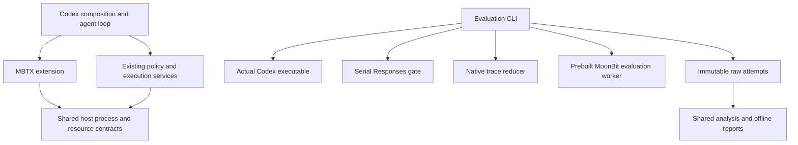

# Programmable MBTX architecture

Status: implemented research architecture for the `ZSeanYves/codex-mbtx-runtime`
fork. The current experimental contract is
[programmable-long-study-v1](mbtx-long-study.md). Linux online research acceptance
is separate from local fixed-replay validation.

## Purpose and scope

The fork compares a programmable MoonBit tool with Codex's existing Shell tool
for autonomous task completion. The primary outcomes are success and accepted
model decisions to success. It is not the historical transparent-launcher
compatibility experiment. Upstream directories retain their normal locations
so builds, upstream merges, tooling and third-party integration remain usable.
The upstream Shell path stays the default. MBTX is explicitly enabled.

## Package ownership

| Location                    | Responsibility                                                                                                                   |
| --------------------------- | -------------------------------------------------------------------------------------------------------------------------------- |
| `codex-rs/ext/mbtx`         | Tool registration, source/file input, compiler plan, per-session compilation cache, bounded previews and reference/resource tool |
| `codex-rs/tools`            | Shared host process contract, full stream archive and UTF-8 resource pagination                                                  |
| `codex-rs/core`             | Narrow bridge to existing policy, approval, sandbox, environment, cancellation and unified execution services                    |
| `codex-rs/config`           | Explicit MBTX configuration and validation                                                                                       |
| `codex-rs/rollout-trace`    | Native append-only observations, payload references, reduction and logical step relationships                                    |
| `mbtx/evaluation`           | Task definitions, private oracles, status classification, step accounting, timing interpretation and statistics                  |
| `mbtx/cmd/evaluation-model` | Prebuilt MoonBit JSON-stream analysis worker                                                                                     |
| `codex-rs/mbtx-eval`        | Actual Codex/OS/HTTP execution, request gate, immutable evidence, worker receipts, adapters and rendering                        |
| `codex-rs/mbtx-eval/web`    | Embedded offline HTML interface and pinned ECharts assets                                                                        |
| `mbtx/reference`            | Verified general language/API/tool guidance visible to both arms                                                                 |
| `mbtx/scripts`              | Thin `.mbtx` preparation, validation, collection and packaging entries                                                           |
| `mbtx/config`               | Non-secret model/relay defaults                                                                                                  |

Product crates must not depend on benchmark tasks, hidden oracles, reports or the
old research repository. The extension consumes a narrow host capability; it
does not embed a second HTTP model client or a competing process/sandbox system.
Rust adapters normalize observed facts. Evaluation decisions live in MoonBit.
Report renderers present the shared analysis model rather than implementing
another statistical rule set.

## Program contract and execution

`mbtx` takes exactly one of `source` or `filename`. Inline source is bounded to
65,536 UTF-8 bytes. A filename is read through the selected Codex environment,
and its executed source bytes are snapshotted. `argv` remains literal; `cwd` uses
the selected environment's filesystem policy. Shared file-edit tools update
saved programs. There is no persistent language heap between invocations.

The chosen execution target is Wasm with the official `moon` and `moonrun` tools.
Builds use the frozen dependency cache, release profile and explicit target.
The runtime can invoke declared native utilities through the MoonBit async API;
this is part of the documented capability set. It is not presented as a
MoonBit-only machine-instruction experiment.

The host preserves the sequence policy/approval → sandbox → spawn → wait/reap →
IO drain → result publication. Cancellation covers preparation and compiler
work as well as execution. Build and run timeouts are distinct tool outcomes;
they do not implicitly terminate the agent task. Default build/run limits are
60/10 seconds, with maximum requested limits of 120/60 seconds. The attempt's
3,600-second wall limit is controlled separately by the evaluator.

The effective config uses `[mbtx]`: `enabled`, absolute `moon` and `moonrun`,
`dependency_cache`, and optional `reference_directory` and `output_directory`.
`observation_socket` is an explicit host-configured permission for one passive
Unix-domain receipt channel. It enables no TCP access, local listener permission
or general Unix socket access. Models cannot choose this grant through tool
arguments. Evaluation config grants the identical channel capability to both
arms, while external network access from task processes remains disabled.

## Output and resource boundaries

Both arms archive stdout and stderr at the host capture boundary before model
preview truncation. PTY output is labeled as a combined terminal stream; it is
not fabricated into separate stdout/stderr observations. Receipts include the
call, phase, stream, observed byte count, SHA-256, EOF, completeness and write
cost. An interrupted capture is incomplete. A failed archive write does not
change the requested program into a setup failure and does not claim complete
diagnostics. Source snapshots also use registered resources.

`read_resource(resource_id, offset, max_bytes)` exposes only approved general
references and the current session's registered resources. It does not compile
MoonBit, accept arbitrary paths, read another attempt or expose the oracle.
Pages respect UTF-8 boundaries and report the actual range, next offset and EOF.
Full bytes are preserved for offline export even when the model preview is
bounded. Both arms use the same Codex token policy, initially 4,096 tokens.

## Cache and build lifecycle

Fixed components are prepared once by `prepare-evaluation.mbtx`. Component
fingerprints include relevant source, dependency locks, toolchain, platform,
target and profile. Product hashes are checked before a component is reused.
Ordinary documentation changes do not invalidate the Codex build. Model-visible
reference changes do invalidate the treatment bundle. Only approved dependency
closure is copied; personal caches and credentials are excluded.

Each MBTX session prepares its dependency copy and build directory once. A
session lock serializes compiler work. Exact compiled artifacts are cached in
host memory using source and effective build-input identity. Source, dependency,
toolchain, target, profile, options or relevant working-directory changes
invalidate reuse. An interrupted preparation cannot publish a partial cache
entry. Every execution writes a separate artifact and starts a fresh runtime
process; runtime outputs and mutable program state are never cached.

Cache hits retain the original compiler diagnostics and identify their source
call. Original build duration is labeled as historical cost; current compilation
cost is zero for a confirmed hit. Necessary model compilation is part of the
treatment, while fixed bundle construction is a separate preparation cost.

## Collection and independent verification

The formal schedule is 80 assigned pairs across ten long-task categories,
separated into 64 workflow pairs and 16 program-delivery pairs. A ten-pair pilot
uses separate inputs. Adjacent pairs alternate AB/BA; batches balance category
and complexity. Both arms share immutable fixture inputs and a precomputed Git
baseline, copied into independently writable workspaces without writable hard
links. Heavy verification, compression and rendering happen after model work.

One persistent local Responses gate forwards all requests serially. Relay starts
are at least 15 seconds apart, and the permit lasts through the stream. Probes,
auxiliary calls and any received transport retries use that gate. A 429 remains
evidence and delays later requests according to valid Retry-After or a 30-second
fallback. No successful-sample replacement or latency-based sample selection
is permitted. The frozen manifest records configuration and collection conditions.

Native Codex HTTP retries and agent stream reconnects have separate finite limits
(two retries each by default, configurable from zero to five). The evaluation
configuration disables upstream's default unbounded connection-retry feature.
The gateway's HTTP client performs no implicit resends, so every actual request
is paced and recorded. A recovered network failure remains in the evidence;
terminal task success, observed external failures and the two retry counts are
reported separately. Normal agent decisions and tool calls retain no count cap.

The independent MoonBit oracle checks outputs and authorized state changes.
Tasks requiring process execution use host receipts from the hash-verified worker
executable, authenticated by the local peer PID. Delivery programs execute on
fresh inputs after the original session ends. Successful fallback cleanup or a
correct artifact cannot overwrite a failed execution/session terminal state.

## Evidence, analysis and report contract

Attempts are allocated exclusively, written append-only and sealed with hashes.
Resume runs missing assignments; it never rewrites completed or censored
attempts. Step and request boundaries come from native Codex trace and OTel.
Started and accepted decisions, tool calls, actual HTTP starts, compilations,
resource reads and failures remain distinct. Transport retries and auxiliary
requests are not task decisions. Unknown time, usage or lifecycle values remain
null. Model-private reasoning is outside the observation boundary.

The Rust adapter may cache sealed-attempt derivations, keyed by raw seals and
analyzer identity, outside raw attempts. Final generation verifies raw hashes
before reuse. The cache is disposable; reports can be rebuilt without current
credentials or environment-dependent task inputs. The progress log tails new
events rather than repeatedly reducing and resampling all historical attempts.

The shared analysis model drives JSON, CSV, Markdown and standalone HTML.
Unstarted samples are reported explicitly; failures remain in denominators.
Conditional paired estimates require two successes and complete step evidence.
Workflow and delivery are never pooled. Fixed-seed stratified bootstrap samples
inputs and nested repetitions; repetitions do not become independent tasks.

The HTML includes pinned ECharts 6.0.0, lazy per-attempt compressed data and all
recorded steps, arguments, model-visible outputs and diagnostics. Untrusted
content is rendered as text. There is no network dependency or SigNoz deployment.
Raw HTTP/SSE and binaries remain in the evidence archive; native OTLP and a
standard trace JSON projection remain available for independent inspection.

## Timing and attribution

Writer-entry monotonic timestamps precede trace serialization and IO. Collector,
native trace, worker receipts and process elapsed measurements have explicit
clock domains. Cross-domain timestamps are not directly subtracted. A wait
observation is not a kernel exit timestamp. Client-observed request intervals
can include transport and observation backpressure; provider compute and relay
waiting remain inseparable without server evidence.

Preparation, pacing, tool preparation/cache/build/run, drain, evidence writes and
post-execution verification have separate observations where available. Spans
can overlap. The report does not add them to manufacture a complete partition;
unattributed duration remains unknown. Minimal/full local calibration measures
the incremental native OTLP cost over required audit capture, not zero-overhead
execution. Calibration averages are never deducted from online results.

## Validation and evolution

Fast CI checks MoonBit, Rust adapter/runtime contracts and interfaces. Offline
integration builds one bundle, runs actual Codex fixed responses, validates all
category/complexity combinations, cache reuse, long decision chains, external
faults, interruption, immutable resume and report reconstruction. CI exposes one
aggregate MBTX required status. Real relay collection is a separate user-run
Linux task; macOS results never stand in for Linux evidence.

Follow repository Cargo/Bazel/schema rules. New automation stays in `.mbtx`.
Extend lower-level contracts when necessary; do not grow core with benchmark
logic. Historical implementation records remain available in the stage-one,
stage-two and stage-three documents. They describe their original evidence;
current interfaces and research acceptance follow this architecture and the
long-study protocol. No backend default changes follow without a separate
evidence-based decision.
